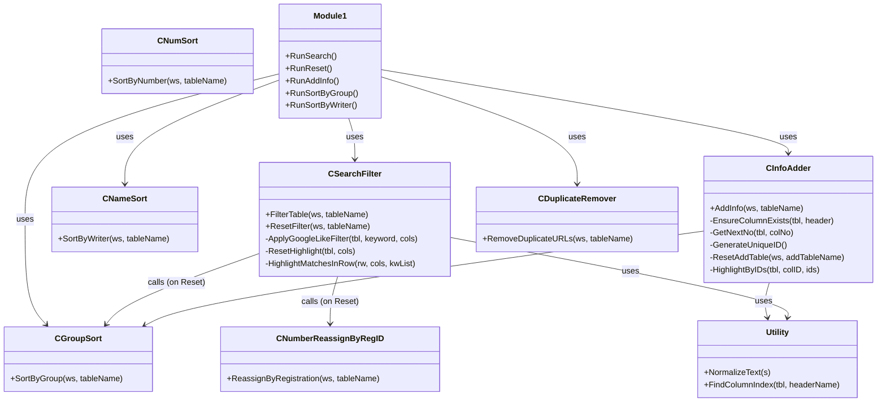
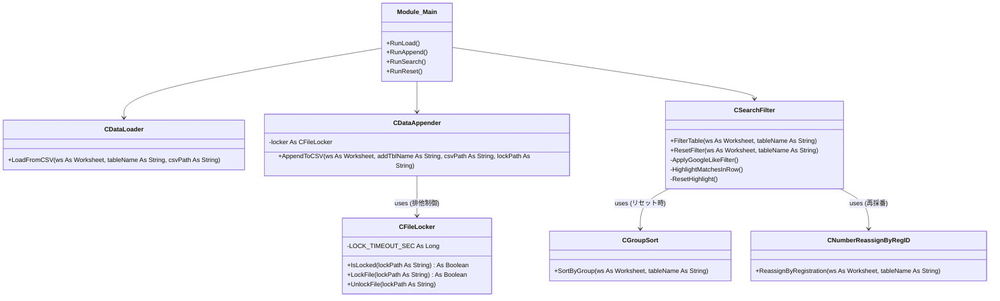
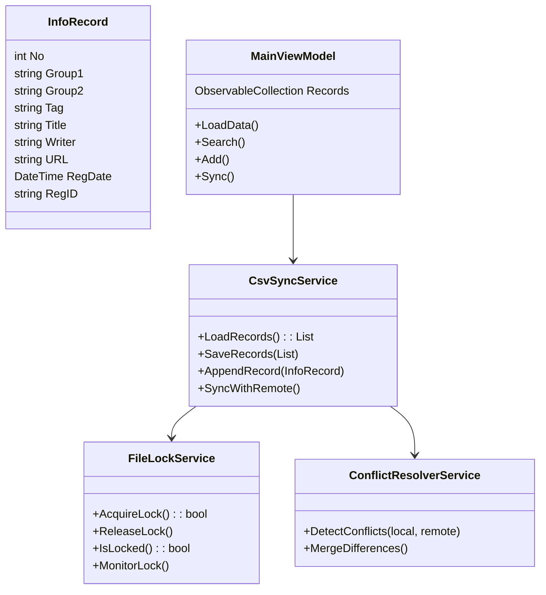

#Publish 
# マスター情報検索リスト
## 目次
- [[#既存機能]]
  - [[#機能一覧]]
  - [[#クラス図]]
- [[#VBA+CSVによる新実装]]
- [[#新実装検討]]
  - [[#どの言語で実装するか(まぁ運び方としておかしいけど)]]
  - [[#C#で開発するときの構成]]
  - [[#フォルダ構成]]
  - [[#各クラスの概要]]
    - [[#設定ファイル]]
      - [[#設定ファイルとは]]
- [[#課題バラシ]]

#Software #Work 


## Ver.1
### 既存機能
#### 機能一覧

| 機能カテゴリ      | クラス名/ 機能名                         | 概要                | 主な処理内容                                                                                                                                  |
| ----------- | ----------------------------------- | ------------------ | --------------------------------------------------------------------------------------------------------------------------------------- |
| **検索・絞り込み** | `CSearchFilter`                     | 条件検索とリセット、ハイライト制御  | - 情報グループ#1・#2・タグ・タイトル・著者によるフィルタ- Google風AND/OR検索<br>- 検索結果件数の表示- ハイライト表示と解除- リセット時にNo.再採番と情報グループソート                                   |
| **ソート処理**   | `CGroupSort`                        | 情報グループ#1,2 に基づくソート| - 「制御開発業務」を最優先、下位グループをあいueお順ソート                                                                                                       |
|             | `CNumSort`                          | No.順のソート         | - 数値型のソートNo.列ベース                                                                                                                     |
|             | `CNameSort`                         | 著者名のソート          | - 著者名をあいうえお順ソート                                                                                                                      |
| **情報追加処理**  | `CInfoAdder`                        | 新規情報をテーブルに追加       | - 入力用テーブルから情報追加テーブルからデータ読込<br>- 未入力セル検出と警告＋一時ハイライト 連番No.自動付与 登録日時と登録ID自動生成<br>- 追加行を一時ハイライト 追加後に`CGroupSort`呼び出し<br>- 入力用テーブルの行を元に戻す|
| **重複除去処理**    | `CDuplicateRemover`                 | URLの重複除去           | - URL列の値が同一なら後行を削除                                                                                                                     |
| **採番管理**    | `CNumberReassignByRegID`            | 登録順No.再採番         | - 登録日時＋登録IDで順ソートし、No.を振り直す                                                                                                          |
| **ユーティリティ** | `NormalizeText` / `FindColumnIndex` | 共通補助関数群            | - 全角半角スペース除去・トリム- テーブル列インデックス取得                                                                                                        |
| **UI連携**    | 標準モジュール (`Module1`)                 | ボタンイベントなど          | - 「検索」「リセット」「追加」「ソート」ボタンに対応 各クラスのインスタンス化して実行                                                                                          |

#### クラス図




### VBA+CSVによる新実装


| クラス名                      | 主な責任               | 機能詳細                                                                                                                                   |
| -------------------------- | ------------------- | -------------------------------------------------------------------------------------------------------------------------------------- |
| **CFileLocker**            | **排他制御の中心クラス**      | - `IsLocked()`で既存lockファイルを検知 他人が書き込み中か判定<br>- `LockFile()`で書き込み開始時にロックを作成 <br>- `UnlockFile()`で完了後に解除 <br>- タイムアウトでロック自動解除 デッドロック防止|
| **CDataLoader**            | **OneDrive上CSVの読込** | - 起動時・更新ボタン押下時に`master_data.csv`を読み込み <br>- ローカルテーブルを最新化<br>- 読込エラー処理あり                                                               |
| **CDataAppender**          | **登録(追記)＋排他制御**     | - `CFileLocker`でロック取得 安全に追記処理<br>- 新しい行をCSVへ追加 既存内容は壊さない<br>- 書き込み完了後ロック解除 <br>- マクロ異常終了時もタイムアウト解除で安全                               |
| **CSearchFilter**          | **ローカル検索(絞込・リセット)**  | - 各フィールド(情報グループ,2,タグ,タイトル,著者)を条件にフィルタ <br>- Google風検索(AND/OR/引用符検索)<br>- 一致部分をハイライト表示 <br>- リセットでハイライトとフィルタ解除 ソート＋No再採番            |
| **CGroupSort**             | **情報グループ別ソート**      | - 「制御開発業務/制御開発業務以外」順で整理<br>- 各グループは五十音順                                                                                             |
| **CNumberReassignByRegID** | **No.再採番処理**        | - 登録日時＋登録ID順で並び替えNoを振り直す                                                                                                             |
| **Module_Main**            | **イベント制御/UI操作の窓口** | - `RunLoad()`でCSV読込 起動と更新ボタン<br>- `RunAppend()`で登録ボタン押下処理- `RunSearch()`で検索ボタン - `RunReset()`でリセットボタン                               |


### 新実装検討
#### どの言語で実装するか(まぁ運び方としておかしいけど)

|観点|Python|C#|Web(Electron/JS)|
|---|---|---|---|
|OneDrive連携|○|◎|◎|
|GUIの質|△|◎|○|
|同時編集対応|△(要作成)|○|◎|
|開発スピード|◎|○|△|
|配布のしやすさ|△|◎|◎|
|拡張性(将来的Web化など)|○|○|◎|
#### C#で開発するときの構成
| 項目     | 対応方法                                                |
| ------ | ---------------------------------------------------- |
| データ構造  | `DataTable` or `ObservableCollection` を中心構造           |
| 永続化    | OneDrive上`master_data.csv`を同期対象 ローカルキャッシュ→差分ロード|
| クラス構成  | 上記VBAクラスをC#クラスに1:1移植（命名維持）                          |
| 同時編集対策 | 書き込み時排他ロックファイル or タイムスタンプ比較                     |
| GUI    | WPF + MVVM構成 検索画面/結果テーブル・追加フォーム・リセットボタンを実現            |
#### フォルダ構成
📦 DataManagerApp/
├─ 📁 Models/                       データ構造定義
│  ├─ InfoRecord.cs                // 情報1件の構造 No, Group1, Group2, ...
│  └─ SyncMetadata.cs              // CSVファイル更新日時やLock状態を管理
├─ 📁 Services/                     機能ロジック層
│  ├─ CsvSyncService.cs            // OneDrive CSV読み書きと同期処理
│  ├─ FileLockService.cs           // 排他制御(.lockファイル管理)
│  ├─ SearchFilterService.cs       // 検索・ハイライトとリセット
│  ├─ GroupSortService.cs          // 情報グループ順ソート
│  ├─ NameSortService.cs           // 著者名ソート（あいうえお順）
│  ├─ NumberSortService.cs         // No.ソート
│  ├─ InfoAddService.cs            // 入力画面レコード追加
│  ├─ DuplicateRemoverService.cs   // URL重複除去
│  ├─ NumberReassignService.cs     // No.再採番 登録日時順
│  └─ ConflictResolverService.cs   // 競合検知・マージ処理(差分更新用)
├─ 📁 ViewModels/                   UIロジック層 MVVM
│  ├─ MainViewModel.cs             // 全体制御 同期とロック・イベント連携
│  ├─ SearchPanelViewModel.cs      // 検索画面ロジック
│  └─ AddPanelViewModel.cs         // 情報追加画面ロジック
├─ 📁 Views/                        GUIレイヤ WPF
│  ├─ MainWindow.xaml              // メイン画面
│  ├─ SearchPanel.xaml             // 検索UI
│  └─ AddPanel.xaml                // 追加UI
├─ 📁 Utils/                        共通関数群
│  ├─ TextNormalizer.cs            // 全角半角空白処理
│  ├─ FileHelper.cs                // CSV・ロックファイル操作共通部品
│  └─ Logger.cs                    // ログ出力
├─ 📁 Data/                         ローカルキャッシュ
│  ├─ master_data_local.csv        // OneDrive同期コピー
│  └─ master_data.lock             // ローカル側一時ロック 同期時に利用
├─ 📁 Assets/                       アイコン・画像など
├─ 📁 Config/                       設定ファイル関連
│  └─ AppSettings.json             // OneDriveパス・更新間隔・ユーザー名など
├─ App.xaml
├─ App.xaml.cs
└─ Program.cs

#### 各クラスの概要
🔸 **コードをロジックに分割**  
🔸 **環境設定をAppSettings.json(設定ファイル)に分割**

| 階層             | ファイル                         | 主な責任                              |
| -------------- | ---------------------------- | ---------------------------------- |
| **Models**     | `InfoRecord.cs`              | CSVの1行データを表現。No・登録日時を含む。          |
|                | `SyncMetadata.cs`            | 同期状態（最終更新時刻、ロック保持者など）を保持。         |
| **Services**   | `CsvSyncService.cs`          | OneDrive上CSVの読み書きと差分マージ処理        |
|                | `FileLockService.cs`         | `.lock` ファイル作成・削除・監視。             |
|                | `ConflictResolverService.cs` | 編集競合を検知して自動マージ。                   |
|                | `SearchFilterService.cs`     | 検索条件解析とフィルタ処理                     |
|                | `InfoAddService.cs`          | 入力検証・ID生成・追加処理                     |
|                | `NumberReassignService.cs`   | 登録順No.再採番。                       |
| **ViewModels** | `MainViewModel.cs`           | View操作（検索/追加/同期ボタン）とサービス連携。       |
| **Utils**      | `FileHelper.cs`              | ファイルI/O共通。`StreamReader/Writer`管理 |
| **Config**     | `AppSettings.json`           | OneDriveのパス設定、ユーザー名などを保持。         |


##### 設定ファイル
| 設定内容                  | 説明               |
| --------------------- | ----------------- |
| `OneDrivePath`        | 共有CSVファイルの絶対パス    |
| `LockFilePath`        | `.lock` ファイルのパス   |
| `SyncIntervalSeconds` | 自動同期の間隔           |
| `UserName`            | 編集者の識別名（排他制御・履歴用）|
###### 設定ファイルとは

- **プログラムをコンパイルせずに設定を変更できる**
    
- **ユーザーごとに異なる設定を切り替えられる**
    
- **機密情報(ファイルパス、ユーザー名、APIキーなど)を安全に管理できる**

### 課題バラシ

```mermaid
flowchart TD

    %% CSV + VBA ルート
    A1[要件整理<br>Excelベースで構想]
    A2[CSV+VBAで試作実装]
    A3[先輩レビュー(第1承認)]
    A4[週次ミーティングで共有と改善]
    A5[上長レビュー(最終承認)]
    A6{VBAで十分か？}
    A7[正式運用開始]
    A8[C#開発へ移行]

    %% C# ルート
    B1[C# 実装計画書作成]
    B2[先輩レビュー(計画承認)]
    B3[上長レビュー(開発承認)]
    B4[C#実装開始]
    B5[C#評価・統合検討]

    %% CSV + VBA フロー
    A1 --> A2 --> A3 --> A4 --> A5 --> A6
    A6 -->|はい 十分| A7
    A6 -->|いいえ(改良必要)| A8

    %% C# フロー(並行開始)
    A2 --> B1
    B1 --> B2 --> B3
    B3 -->|承認| B4 --> B5
    B3 -->|却下 or VBAで十分| A7

    %% 出力
    A7 -->|最終成果物| Z[業務投入・共有運用開始]
    B5 -->|成果比較を採用判断| Z

```

## Ver.2